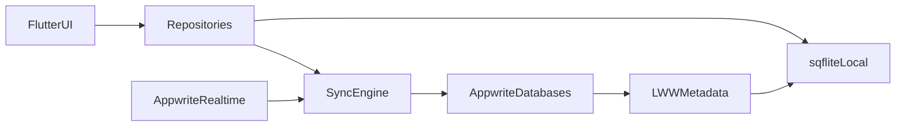

# Appwrite database schema (Supabase migration)

This document is the **authoritative map** from Supabase tables used by WhatsUnity to **Appwrite collections** (Databases / documents API). It accompanies [MIGRATION_PLAN.md](MIGRATION_PLAN.md) Phase 3 and the provisioning script [tools/provision_appwrite_schema.dart](tools/provision_appwrite_schema.dart).

**Environment (script / console)**  
- `APPWRITE_ENDPOINT` — e.g. `https://cloud.appwrite.io/v1` or self‑hosted URL  
- `APPWRITE_PROJECT_ID`  
- `APPWRITE_API_KEY` — server key with databases scope (do not commit)  
- `APPWRITE_DATABASE_ID` — target database id (e.g. `whats_unity` — create once or let script create)

**Runtime note (Flutter app)**  
The app currently uses the **client** `appwrite` package for `Account` / Session; new DB access will use the same `Client` with **session** and document permissions.

---

## 1. Locked decisions

| Topic | Choice |
| --- | --- |
| Foreign keys | **Plain `String` attributes** (36‑char id style). **No** Appwrite Relationship attributes — sync and LWW stay in the app; no server cascade. |
| JSON / nested Supabase data | **One `String` attribute** per blob; `jsonEncode` / `jsonDecode` at the repository layer. LWW replaces the whole blob. |
| Legacy numeric ids | **Numeric PKs (compound, building, channel, report, category) are not carried forward** as integers. **Appwrite document `$id`** (and matching string fields where the app used ints) is authoritative. |
| LWW (every collection) | `version` (integer, default 0) + `deleted_at` (datetime, optional) on each document, plus Appwrite system `$createdAt` / `$updatedAt`. |
| Soft delete | `deleted_at` set when logically deleted; filter in queries. |
| `profiles` document id | **Equals Appwrite auth user id** (same as current Supabase `profiles.id` after Phase 2). |
| `user_roles` | Document `$id` may equal `user_id` for one row per user (upsert pattern), or `ID.unique()` with unique index on `user_id`. **Schema below**: `$id` = `user_id` when a single role row. |
| `presence_sessions` | New collection for Phase 3 presence; **no** Supabase source table. document `$id` = `user_id` (optional pattern). |
| `Report_user` row shape | **CamelCase** fields match [user_report_model.dart](lib/features/admin/data/models/user_report_model.dart) (`authorId`, `reportedUserId`, …), not `snake_case` from the old plan name list. Add optional `compoundId` (string) for future admin scoping. |

**Why not Relationship attributes**  
They imply referential behavior and complicate **offline-first** and **LWW** merges. Flat string FKs match local `sqflite` and keep ordering fully client-controlled.

**OTP / email verification**  
[otp_screen.dart](lib/features/auth/presentation/pages/otp_screen.dart) may still use Supabase `verifyOTP` until Phase 5. **No** DB column is required; Appwrite `Account` verification is auth-layer, not a collection field.

**Chat RPC**  
`get_messages_with_pagnation` is **not** represented in the schema. Replace with an Appwrite Function and/or list queries on `messages` in a later phase.

**Storage (Cloudflare R2 + Gumlet)**  
File URLs remain **opaque strings** in `metadata`, `source_url` JSON, `uri`, `verFiles`, and other media blobs. **Convention:** **R2** for static files — images, PDFs, generic attachments, verification files (optionally behind your CDN). **Gumlet** for **voice-note / voice-recording audio and video** (playback URLs from the [Gumlet Video API](https://docs.gumlet.com/reference/create-asset)). Encode optional Gumlet `asset_id` (or equivalent) **inside** existing JSON metadata for time-based media — no new collection attributes required for the split.

---

## 2. Conventions (attribute tables)

- **$id** — Appwrite document id (not a custom attribute in tables below; you pass it on create with `ID.unique()` unless noted).  
- **type** — Appwrite attribute type. `string(n)` = max length.  
- **Array** — `[]` in notes means Appwrite “array of type”, if used; this schema **defaults to JSON strings** for list/map payloads.  
- **System** — `$createdAt`, `$updatedAt` are automatic; no create step.  
- Index names in script use short **snake_case** `idx_*`.

---

### 2.1 `profiles`

Replaces: `profiles`

| attribute | type | size / notes | required | default | array? | notes |
| --- | --- | --- | --- | --- | --- | --- |
| full_name | string | 256 | no | null | no |  |
| display_name | string | 128 | no | null | no | fulltext in indexes |
| avatar_url | string | 2000 | no | null | no |  |
| phone_number | string | 64 | no | null | no |  |
| owner_type | string | 64 | no | null | no | e.g. enum name from app |
| userState | string | 32 | no | null | no | admin moderation |
| actionTakenBy | string | 128 | no | null | no |  |
| verFiles | string | 50000 | no | null | no | **JSON** list of file maps |
| version | integer | — | yes | 0 | no | LWW |
| deleted_at | datetime | — | no | null | no | LWW / tombstone |

**Document `$id`**: Appwrite `Account` user id (UUID).

**Indexes**

| key (name) | type | attributes | order |
| --- | --- | --- | --- |
| idx_profiles_display_name_ft | fulltext | display_name | — |
| idx_profiles_full_name_ft | fulltext | full_name | — |
| idx_profiles_userState | key | userState | asc |

---

### 2.2 `user_roles`

Replaces: `user_roles`

| attribute | type | size | required | default | array? | notes |
| --- | --- | --- | --- | --- | --- | --- |
| user_id | string | 36 | yes | — | no | same as id if 1:1 document id pattern |
| role_id | integer | — | yes | — | no |  |
| version | integer | — | yes | 0 | no |  |
| deleted_at | datetime | — | no | null | no |  |

**Indexes**

| key | type | attributes | order |
| --- | --- | --- | --- |
| idx_user_roles_user_id | unique | user_id | asc |

---

### 2.3 `user_apartments`

Replaces: `user_apartments`

| attribute | type | size | required | default | array? | notes |
| --- | --- | --- | --- | --- | --- | --- |
| user_id | string | 36 | yes | — | no |  |
| compound_id | string | 36 | yes | — | no | was int |
| building_num | string | 128 | yes | — | no |  |
| apartment_num | string | 64 | yes | — | no |  |
| version | integer | — | yes | 0 | no |  |
| deleted_at | datetime | — | no | null | no |  |

**Indexes**

| key | type | attributes | order |
| --- | --- | --- | --- |
| idx_ua_user_id | key | user_id | asc |
| idx_ua_compound_building_apt | unique | compound_id, building_num, apartment_num | all asc |

---

### 2.4 `buildings`

Replaces: `buildings`

| attribute | type | size | required | default | array? | notes |
| --- | --- | --- | --- | --- | --- | --- |
| compound_id | string | 36 | yes | — | no |  |
| building_name | string | 256 | yes | — | no |  |
| version | integer | — | yes | 0 | no |  |
| deleted_at | datetime | — | no | null | no |  |

**Indexes**

| key | type | attributes | order |
| --- | --- | --- | --- |
| idx_buildings_compound_name | unique | compound_id, building_name | all asc |

---

### 2.5 `channels`

Replaces: `channels`

| attribute | type | size | required | default | array? | notes |
| --- | --- | --- | --- | --- | --- | --- |
| compound_id | string | 36 | yes | — | no |  |
| building_id | string | 36 | yes | — | no | was int |
| name | string | 256 | yes | — | no |  |
| type | string | 64 | yes | — | no | e.g. BUILDING_CHAT |
| version | integer | — | yes | 0 | no |  |
| deleted_at | datetime | — | no | null | no |  |

**Indexes**

| key | type | attributes | order |
| --- | --- | --- | --- |
| idx_channels_compound_building_type | unique | compound_id, building_id, type | all asc |

---

### 2.6 `compound_categories`

Replaces: `compound_categories`

| attribute | type | size | required | default | array? | notes |
| --- | --- | --- | --- | --- | --- | --- |
| name | string | 256 | yes | — | no |  |
| slug | string | 128 | no | null | no | reserved for future routing |
| version | integer | — | yes | 0 | no |  |
| deleted_at | datetime | — | no | null | no |  |

**Indexes** — none required for current read patterns (low volume); optional: key on `name`.

---

### 2.7 `compounds`

Replaces: `compounds`

| attribute | type | size | required | default | array? | notes |
| --- | --- | --- | --- | --- | --- | --- |
| category_id | string | 36 | no | null | no | was int FK |
| name | string | 256 | yes | — | no |  |
| developer | string | 256 | no | null | no |  |
| city | string | 128 | no | null | no |  |
| picture_url | string | 2000 | no | null | no | `logo` / picture |
| version | integer | — | yes | 0 | no |  |
| deleted_at | datetime | — | no | null | no |  |

**Indexes**

| key | type | attributes | order |
| --- | --- | --- | --- |
| idx_compounds_category | key | category_id | asc |

---

### 2.8 `report_user`

Replaces: `Report_user` (PascalCase in Supabase client)

| attribute | type | size | required | default | array? | notes |
| --- | --- | --- | --- | --- | --- | --- |
| authorId | string | 36 | yes | — | no | reporter |
| createdAt | datetime | — | yes | — | no |  |
| reportedUserId | string | 36 | yes | — | no |  |
| state | string | 64 | yes | — | no |  |
| description | string | 8000 | yes | — | no |  |
| messageId | string | 64 | no | null | no |  |
| reportedFor | string | 64 | no | null | no |  |
| compoundId | string | 36 | no | null | no | optional scope for future filters |
| version | integer | — | yes | 0 | no |  |
| deleted_at | datetime | — | no | null | no |  |

**Indexes**

| key | type | attributes | order |
| --- | --- | --- | --- |
| idx_report_user_reported | key | reportedUserId | asc |
| idx_report_user_compound | key | compoundId | asc |

---

### 2.9 `messages`

Replaces: `messages`

| attribute | type | size | required | default | array? | notes |
| --- | --- | --- | --- | --- | --- | --- |
| author_id | string | 36 | yes | — | no |  |
| channel_id | string | 36 | yes | — | no | was int |
| text | string | 100000 | no | null | no |  |
| uri | string | 2000 | no | null | no |  |
| type | string | 32 | no | null | no |  |
| sent_at | datetime | — | no | null | no |  |
| metadata | string | 50000 | no | null | no | **JSON** |
| reply_to | string | 64 | no | null | no | denormalized from metadata for index/filter |
| deleted_at | datetime | — | no | null | no |  |
| version | integer | — | yes | 0 | no |  |

`$id` is the message UUID (existing client code uses UUID v4).

**Indexes**

| key | type | attributes | order |
| --- | --- | --- | --- |
| idx_msg_channel | key | channel_id | asc |
| idx_msg_channel_created | key | channel_id, $createdAt | desc on `$createdAt` |
| idx_msg_author | key | author_id | asc |

---

### 2.10 `message_receipts`

Replaces: `message_receipts`

| attribute | type | size | required | default | array? | notes |
| --- | --- | --- | --- | --- | --- | --- |
| message_id | string | 64 | yes | — | no |  |
| user_id | string | 36 | yes | — | no |  |
| seen_at | datetime | — | yes | — | no |  |
| version | integer | — | yes | 0 | no |  |
| deleted_at | datetime | — | no | null | no |  |

**Indexes**

| key | type | attributes | order |
| --- | --- | --- | --- |
| idx_receipts_msg_user | unique | message_id, user_id | all asc |

---

### 2.11 `maintenance_reports`

Replaces: `MaintenanceReports`

| attribute | type | size | required | default | array? | notes |
| --- | --- | --- | --- | --- | --- | --- |
| user_id | string | 36 | yes | — | no |  |
| compound_id | string | 36 | no | null | no |  |
| title | string | 512 | yes | — | no |  |
| description | string | 20000 | yes | — | no |  |
| category | string | 128 | yes | — | no |  |
| type | string | 64 | yes | — | no |  |
| status | string | 64 | no | null | no |  |
| version | integer | — | yes | 0 | no |  |
| deleted_at | datetime | — | no | null | no |  |

**Indexes**

| key | type | attributes | order |
| --- | --- | --- | --- |
| idx_maint_compound_type | key | compound_id, type | asc, asc |
| idx_maint_compound_type_status | key | compound_id, type, status | all asc |

---

### 2.12 `maintenance_attachments`

Replaces: `MReportsAttachments`

| attribute | type | size | required | default | array? | notes |
| --- | --- | --- | --- | --- | --- | --- |
| report_id | string | 36 | yes | — | no |  |
| compound_id | string | 36 | no | null | no |  |
| type | string | 64 | yes | — | no |  |
| source_url | string | 100000 | yes | — | no | **JSON** array of maps |
| version | integer | — | yes | 0 | no |  |
| deleted_at | datetime | — | no | null | no |  |

**Indexes**

| key | type | attributes | order |
| --- | --- | --- | --- |
| idx_matt_report | key | report_id | asc |
| idx_matt_compound_type | key | compound_id, type | asc, asc |

---

### 2.13 `maintenance_history`

Replaces: `MReportsHistory`

| attribute | type | size | required | default | array? | notes |
| --- | --- | --- | --- | --- | --- | --- |
| report_id | string | 36 | yes | — | no |  |
| actor_id | string | 36 | yes | — | no |  |
| action | string | 20000 | yes | — | no |  |
| created_at | datetime | — | yes | — | no |  |
| version | integer | — | yes | 0 | no |  |
| deleted_at | datetime | — | no | null | no |  |

**Indexes**

| key | type | attributes | order |
| --- | --- | --- | --- |
| idx_mhist_report | key | report_id | asc |

---

### 2.14 `posts`

Replaces: `Posts`

| attribute | type | size | required | default | array? | notes |
| --- | --- | --- | --- | --- | --- | --- |
| compound_id | string | 36 | yes | — | no |  |
| author_id | string | 36 | yes | — | no |  |
| post_head | string | 10000 | yes | — | no |  |
| source_url | string | 100000 | no | null | no | **JSON** list of media maps |
| getCalls | boolean | — | no | null | no |  |
| Comments | string | 200000 | no | null | no | **JSON** list; keep key name for parity with Supabase / Dart |
| version | integer | — | yes | 0 | no |  |
| deleted_at | datetime | — | no | null | no |  |

**Indexes**

| key | type | attributes | order |
| --- | --- | --- | --- |
| idx_posts_compound_created | key | compound_id, $createdAt | asc, desc on `$createdAt` |

---

### 2.15 `brainstorms`

Replaces: `BrainStorming`

| attribute | type | size | required | default | array? | notes |
| --- | --- | --- | --- | --- | --- | --- |
| channel_id | string | 36 | yes | — | no |  |
| compound_id | string | 36 | yes | — | no |  |
| author_id | string | 36 | yes | — | no |  |
| title | string | 2000 | yes | — | no |  |
| imageSources | string | 100000 | no | null | no | **JSON** |
| options | string | 200000 | no | null | no | **JSON** |
| votes | string | 200000 | no | null | no | **JSON** |
| comments | string | 200000 | no | null | no | **JSON** |
| version | integer | — | yes | 0 | no |  |
| deleted_at | datetime | — | no | null | no |  |

`$id` = client UUID (same as `SocialRemoteDataSource.createBrainStorm` today).

**Indexes**

| key | type | attributes | order |
| --- | --- | --- | --- |
| idx_brain_channel_compound_created | key | channel_id, compound_id, $createdAt | asc, asc, desc on `$createdAt` |

---

### 2.16 `presence_sessions` (new)

| attribute | type | size | required | default | array? | notes |
| --- | --- | --- | --- | --- | --- | --- |
| user_id | string | 36 | yes | — | no |  |
| compound_id | string | 36 | no | null | no |  |
| status | string | 32 | no | null | no |  |
| last_seen_at | datetime | — | no | null | no |  |
| version | integer | — | yes | 0 | no |  |
| deleted_at | datetime | — | no | null | no |  |

**Indexes**

| key | type | attributes | order |
| --- | --- | --- | --- |
| idx_presence_user | unique | user_id | asc |
| idx_presence_compound | key | compound_id | asc |
| idx_presence_last_seen | key | last_seen_at | asc |

---

## 3. JSON blob shapes (decode at repository layer)

| attribute | expected JSON shape (after decode) | size cap (chars, guidance) |
| --- | --- | --- |
| verFiles | `List<Map<String, dynamic>>` | 50k string attr |
| messages.metadata | voice/text/file meta; `reply_to` also on root attr. **Voice and video** entries: Gumlet playback URL / optional `asset_id`. **Images and generic files**: **R2** URLs (same JSON shape, different origin). | 50k |
| posts.Comments / source_url | list of comment / media objects; **video** items → Gumlet, **static images** → **R2** | 200k / 100k |
| maintenance_attachments.source_url | list of url maps; **video** → Gumlet, **photos/PDFs** → **R2** | 100k |
| brainstorms: imageSources, options, votes, comments | per social models; **video** (if present) → Gumlet, images → **R2** where applicable | 200k each |

**Rule**: keep blobs under the attribute `size`; for rare overflow, split into Storage + pointer rows in a later iteration.

---

## 4. Index summary (all)

| collection | key | type | attributes | orders |
| --- | --- | --- | --- | --- |
| profiles | idx_profiles_display_name_ft | fulltext | display_name |  |
| profiles | idx_profiles_full_name_ft | fulltext | full_name |  |
| profiles | idx_profiles_userState | key | userState | asc |
| user_roles | idx_user_roles_user_id | unique | user_id | asc |
| user_apartments | idx_ua_user_id | key | user_id | asc |
| user_apartments | idx_ua_compound_building_apt | unique | compound_id, building_num, apartment_num | asc×3 |
| buildings | idx_buildings_compound_name | unique | compound_id, building_name | asc, asc |
| channels | idx_channels_compound_building_type | unique | compound_id, building_id, type | asc×3 |
| compounds | idx_compounds_category | key | category_id | asc |
| report_user | idx_report_user_reported | key | reportedUserId | asc |
| report_user | idx_report_user_compound | key | compoundId | asc |
| messages | idx_msg_channel | key | channel_id | asc |
| messages | idx_msg_channel_created | key | channel_id, $createdAt | asc, desc |
| messages | idx_msg_author | key | author_id | asc |
| message_receipts | idx_receipts_msg_user | unique | message_id, user_id | asc, asc |
| maintenance_reports | idx_maint_compound_type | key | compound_id, type | asc, asc |
| maintenance_reports | idx_maint_compound_type_status | key | compound_id, type, status | asc×3 |
| maintenance_attachments | idx_matt_report | key | report_id | asc |
| maintenance_attachments | idx_matt_compound_type | key | compound_id, type | asc, asc |
| maintenance_history | idx_mhist_report | key | report_id | asc |
| posts | idx_posts_compound_created | key | compound_id, $createdAt | asc, desc |
| brainstorms | idx_brain_channel_compound_created | key | channel_id, compound_id, $createdAt | asc, asc, desc |
| presence_sessions | idx_presence_user | unique | user_id | asc |
| presence_sessions | idx_presence_compound | key | compound_id | asc |
| presence_sessions | idx_presence_last_seen | key | last_seen_at | asc |

**Composite ordering**: Appwrite `createIndex` accepts `OrderBy` per attribute (see script).

**Note on `$createdAt` in index**: Supported as system attribute; provisioning script must create attributes first, then index.

---

## 5. Phase 3 app follow-up — int → String (and related)

After schema provision, the Flutter app must **stop using `int` for document-backed ids** where the server is now a string. Non-exhaustive but **actionable** list:

| area | file / symbol | change |
| --- | --- | --- |
| Posts | [post_model.dart](lib/features/social/data/models/post_model.dart) | `compound_id` / `Post.compoundId` int → `String` |
| Social API | [social_remote_data_source.dart](lib/features/social/data/datasources/social_remote_data_source.dart) | `compoundId`, `channelId` parameters and `.eq` values → `String` |
| Social entities | `Post`, brainstorm entities / models that mirror ints | same |
| Chat | [chat_remote_data_source.dart](lib/features/chat/data/datasources/chat_remote_data_source.dart) | all `channelId: int` → `String`; `fetchMessages` / realtime filter; RPC params when replaced |
| Chat UI / cubits | call sites of `ChatRemoteDataSource` | pass string channel ids from `channels` collection |
| Maintenance | [maintenance_remote_data_source.dart](lib/features/maintenance/data/datasources/maintenance_remote_data_source.dart) | `reportId`, `compoundId` (and related methods) int → `String` |
| Maintenance UI | any cubit / page using report or compound as int | align with `String` |
| Admin | [admin_remote_data_source.dart](lib/features/admin/data/datasources/admin_remote_data_source.dart) | `getCompoundMembers(int compoundId)` → `String`; `updateReportStatus(int reportId)` → `String` |
| Admin models | [user_report.dart](lib/features/admin/domain/entities/user_report.dart) / `UserReportModel` | `id` int? → `String?` (Appwrite $id) |
| Auth / compound selection | [auth_repository.dart](lib/features/auth/domain/repositories/auth_repository.dart) + impl + `CacheHelper` | `compoundId` in prefs / `selectCompound` / `isApartmentTaken` / `getDefaultCompoundId` / `loadCompoundMembers` / `completeRegistration` | migrate to `String` compound and building ids |
| Core models | [CompoundsList.dart](lib/core/models/CompoundsList.dart) | `Category.id`, `Compound.id` int → `String` |
| Core config | [supabase.dart](lib/core/config/supabase.dart) / isolate workers | `CompoundIndex` and queries use string ids when targeting Appwrite |

**Chat pagination RPC**  
Replace `get_messages_with_pagnation` with a **Function** and/or `Query` cursors; adjust `fetchMessages` signature accordingly.

---

## 6. Data flow (reference)



---

## 7. Changelog

- **2026-04-24** — Storage: **R2** for static files (images, PDFs, generic attachments, verification); **Gumlet** for **voice and video** (playback URLs and optional `asset_id` in JSON metadata).
- **2026-04-23** — Initial `APPWRITE_SCHEMA.md` and alignment with [appwrite_schema_translation_625b1b5f.plan.md](.cursor/plans/appwrite_schema_translation_625b1b5f.plan.md).

---

## 8. Provisioning

**Machine-readable spec** — [tools/provision_spec.json](tools/provision_spec.json) lists every collection, attribute (encoding: `s` string, `x` text, `i` int, `b` bool, `d` datetime), and index. Edit this JSON to adjust sizes or add fields; the Dart script only interprets it.

Run (after `flutter pub get`):

```bash
dart run tools/provision_appwrite_schema.dart
```

Run from the **project root** (so `.env` and `tools/provision_spec.json` resolve). Requires a **server** API key and the env vars in §0. The script is **idempotent** (409 = already exists). It polls attribute status before creating indexes.

**Deprecation note (SDK)**: The script uses `Databases` (collections) APIs from `dart_appwrite` — marked deprecated in SDK 23+ in favor of `TablesDB`. If your **Appwrite** server no longer exposes `/databases/.../collections`, upgrade the script to `TablesDB` (tables/columns) in a follow-up.
