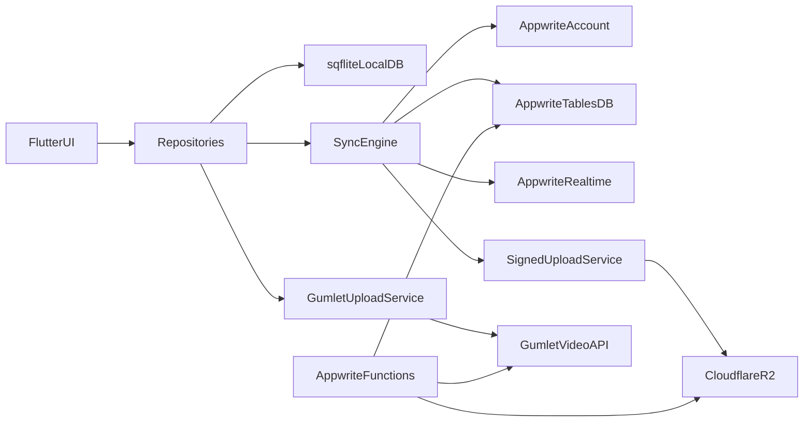
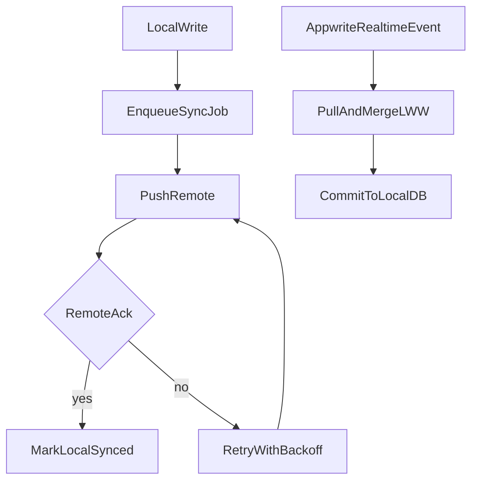

# MIGRATION_PLAN

## Goal
Migrate from Supabase to Appwrite while making the app **offline-first** across all features, with `sqflite` as the local source of truth and background sync to remote services.  
Scope includes `Auth`, `Admin`, `Chat`, `Social`, and `Maintenance` (including maintenance report attachments).

## Locked Decisions
- Local-first reads: UI reads from local `sqflite` tables only.
- Write path: local DB first, then enqueue sync job.
- Conflict strategy: **Last-Write-Wins (LWW)** using server timestamps.
- File storage target — **Cloudflare R2** (default): static blobs only — images, PDFs, generic file attachments, verification files — via signed upload URLs; store `key`, `url`, `mime`, `size` (and dimensions when relevant) on Appwrite documents or inside JSON metadata. **Do not** put user voice recordings or **video** files on R2.
- File storage target — **Gumlet** (voice **and** video): user voice notes / voice-recording audio (e.g. `.m4a`, `.aac`) **and** video (e.g. `.mp4`, `.mov`) wherever the product records or shares time-based media, via [Gumlet Video API](https://docs.gumlet.com/reference/create-asset) (create asset, [direct](https://docs.gumlet.com/reference/create-asset-direct-upload) or multipart upload as you standardize); persist playback URL and optional Gumlet `asset_id` in `messages.metadata`, `posts.source_url`, `maintenance_attachments.source_url`, or equivalent JSON.
- Runtime release strategy: **big-bang backend cutover** after full parity verification.

## Current Supabase Touchpoints (Analyzed)
- `lib/features/auth/data/datasources/auth_remote_data_source.dart`
- `lib/features/auth/data/repositories/auth_repository_impl.dart`
- `lib/features/admin/data/datasources/admin_remote_data_source.dart`
- `lib/features/chat/data/datasources/chat_local_data_source.dart`
- `lib/features/chat/data/datasources/chat_remote_data_source.dart`
- `lib/features/maintenance/data/datasources/maintenance_remote_data_source.dart`
- `lib/features/social/data/datasources/social_remote_data_source.dart`
- `lib/features/chat/presentation/bloc/presence_cubit.dart`
- `lib/core/services/RealtimeUserService.dart`
- `lib/core/services/GoogleDriveService.dart`

---

## 1) Offline-First Architecture Blueprint

### 1.1 Data flow principles
- **Reads**: always from local `sqflite`.
- **Writes**: upsert local row + create sync job.
- **Sync worker**:
  - Push local dirty records to remote.
  - Pull remote changes since last checkpoint.
  - Merge via LWW and update local DB.
- **Deletes**: soft delete (`deleted_at`) locally first, hard delete remote after successful sync.

### 1.2 Required local sync metadata (every entity)
- `local_updated_at`
- `remote_updated_at`
- `sync_state` (`clean`, `dirty`, `pending_delete`, `failed`)
- `version`
- `deleted_at`
- `last_sync_error` (nullable)

### 1.3 Sync queue table
- Table: `sync_jobs`
- Fields:
  - `job_id`, `entity_type`, `entity_id`, `op_type`
  - `payload_json`
  - `attempts`, `status`, `next_retry_at`, `last_error`
  - `created_at`, `updated_at`

### 1.4 Retry policy
- Exponential backoff (e.g., 2s, 5s, 15s, 30s, 60s, capped).
- Dead-letter status after max attempts.
- Recoverable errors requeued; validation/auth errors flagged for user/admin action.

---

## 2) Authentication Mapping (Supabase -> Appwrite)

## 2.1 API mapping
- `signInWithPassword` -> `Account.createEmailPasswordSession`
- `signUp(email, password, data)` -> `Account.create` + profile document create/update
- `signInWithGoogle(idToken/accessToken)` -> Appwrite Google OAuth2 session flow
- `signOut` -> `Account.deleteSession(sessionId: "current")`
- `requestEmailChange` -> Appwrite Account email update flow
- `updatePassword` -> Appwrite password update API

## 2.2 Metadata handling
Supabase metadata and profile fields (`role_id`, `owner_type`, `phone_number`, `userState`, `actionTakenBy`, `verFiles`) move to explicit Appwrite collections:
- `profiles`
- `user_roles`

## 2.3 Session state transition
- Replace direct Supabase auth stream assumptions with:
  - App startup: `account.get()` and session validation.
  - Local auth snapshot cache for bootstrapping UI offline.
  - Sync pause for protected operations when session invalid.

---

## 3) Database Schema Translation (Postgres -> Appwrite + Local sqflite)

## 3.1 Entity mapping
- `profiles` -> Appwrite `profiles` + local `local_profiles`
- `user_roles` -> `user_roles` + `local_user_roles`
- `user_apartments` -> `user_apartments` + `local_user_apartments`
- `buildings` -> `buildings` + `local_buildings`
- `channels` -> `channels` + `local_channels`
- `Report_user` -> `report_user` + `local_report_user`
- `messages` -> `messages` + `local_messages` (already partially present)
- `message_receipts` -> `message_receipts` + `local_message_receipts`
- `MaintenanceReports` -> `maintenance_reports` + `local_maintenance_reports`
- `MReportsAttachments` -> `maintenance_attachments` + `local_maintenance_attachments`
- `MReportsHistory` -> `maintenance_history` + `local_maintenance_history`
- `Posts` -> `posts` + `local_posts`
- `BrainStorming` -> `brainstorms` + `local_brainstorms`

## 3.2 Relational constraints replacement
- SQL joins and FK logic move to:
  - Repository orchestration
  - Appwrite Functions for multi-entity consistency
- `ON DELETE CASCADE` behavior becomes explicit delete orchestration:
  - Parent delete function deletes child documents and related **R2** objects **and Gumlet assets (voice and video)** where applicable.

## 3.3 Upsert/unique behavior
- Supabase `onConflict` patterns become:
  - deterministic document IDs or
  - unique indexed fields + safe create-or-update logic in function/repository.

---

## 4) Realtime & Presence Translation

## 4.1 Chat realtime
- Supabase `onPostgresChanges` on `messages` -> Appwrite realtime subscriptions to message rows.
- Incoming realtime events update local `sqflite` first, then Cubit state emits from local snapshot.

## 4.2 Profile/role realtime
- `RealtimeUserService` subscriptions on `profiles` and `user_roles` map to Appwrite realtime channels on equivalent collections.

## 4.3 Presence
- Replace Supabase presence channel with `presence_sessions` collection:
  - heartbeat updates (`online`, `away`, `offline`)
  - TTL cleanup via scheduled Appwrite Function
  - client subscribes to presence rows by compound/channel scope.

---

## 5) Storage & RPC/Function Migration

## 5.1 Cloudflare R2 (static files) and Gumlet (voice + video)

### 5.1a Cloudflare R2
- Replace Supabase Storage + Google Drive writes with:
  - Request signed upload URL
  - Upload directly to R2
  - Store metadata in Appwrite document (`key`, `url`, `mime`, `size`, dimensions)

**Applies to:**
- verification files
- chat **non-voice, non-video** attachments: images, generic files (documents, etc.)
- social / brainstorm **static** media: images (and any non-video files)
- maintenance report attachments that are **not** video: photos, PDFs, etc.

### 5.1b Gumlet (voice and video)
- **Voice notes / voice-recording** and **video** (chat video messages, video in posts/brainstorms, maintenance video attachments if supported): Appwrite Function (or backend) creates a Gumlet asset and returns upload instructions; client uploads; document/JSON stores Gumlet **playback URL** and optional **`asset_id`** for lifecycle/delete.
- **Images and generic static files** use §5.1a — not Gumlet.

## 5.2 RPC/function mapping
- `get_messages_with_pagnation` -> Appwrite Function endpoint for paginated message retrieval.
- `delete_user` (if exists in DB) -> Appwrite admin Function for account purge + dependent document cleanup + **R2** cleanup + **Gumlet** asset deletion for any referenced **voice or video** media where applicable.

## 5.3 Client vs function rule
- Client-side CRUD: single collection, no cascade, no elevated permissions.
- Function required: cross-collection updates, delete cascades, bulk operations, admin-only actions.

---

## 6) Maintenance Reports Offline-First (Explicit)

## 6.1 Local model requirements
- `local_maintenance_reports`
- `local_maintenance_attachments`
- `local_maintenance_history`
- all with sync metadata fields.

## 6.2 Offline create flow
1. User submits report -> insert local report (`dirty`).
2. Queue `create_report` sync job.
3. If attachments exist:
   - store local attachment record with file path (`pending_upload`)
   - queue `upload_attachment` jobs.
4. UI immediately reads local report list and details.

## 6.3 Sync flow
1. Push report create first.
2. On remote report ID resolution, map local temp ID -> remote ID.
3. Upload each attachment via **R2** (photos, PDFs, etc.) or **Gumlet** (video clips), per file type.
4. Patch report/attachment metadata in Appwrite.
5. Mark local rows `clean`.

## 6.4 Offline status updates / notes
- Status change and note add are local-first writes + queued jobs.
- If report not yet remotely created, dependent jobs wait on parent sync completion.

---

## 7) Phased Execution Checklist

## Phase 0: Contracts & inventory
- Export Supabase schema/functions/policies.
- Finalize entity field parity matrix.
- Define canonical timestamp fields for LWW.

## Phase 1: Local data foundation
- Extend `sqflite` schema beyond chat to all scoped entities.
- Add `sync_jobs`, checkpoints, and tombstone support.

## Phase 2: Sync engine
- Implement generic pull/push worker, retry logic, and dependency ordering.
- Add app lifecycle hooks (foreground/background/network changes).

## Phase 3: Auth + admin + maintenance repositories
- Migrate data source adapters to local-first.
- Implement Appwrite auth and profile/role persistence.
- Implement maintenance offline queue and attachment workflow.

## Phase 4: Social + chat repositories
- Migrate posts/brainstorms and message receipts to local-first.
- Replace chat remote pagination and update flows.

## Phase 5: Realtime + functions
- Replace Supabase realtime listeners with Appwrite subscriptions.
- Deploy pagination, delete cascade, and presence TTL functions.

## Phase 6: Storage cutover
- Replace Google Drive/Supabase storage write paths with **R2** signed uploads for static files and **Gumlet** for **voice and video**.
- Validate media fetch/render (R2 direct URLs vs Gumlet playback / HLS or player SDK expectations).

## Phase 7: Big-bang cutover
- Switch backend env/config to Appwrite + **R2** + **Gumlet** (Gumlet collection / API credentials and R2 bucket config as provisioned).
- Execute smoke/regression suite.
- Monitor sync failures and rollback window.

---

## 8) Architecture Diagrams

---

## 9) Validation & Exit Criteria

## 9.1 Offline behavior
- App boots and renders key screens from local DB without internet.
- Create/update/delete operations work offline and appear immediately.

## 9.2 Sync correctness
- Queued jobs replay successfully when online.
- LWW merges are deterministic and logged.
- No duplicate records after retries/restarts.

## 9.3 Feature parity
- Auth parity: login/signup/google/email-change/password-update/signout.
- Maintenance parity: report create/read/update/history/attachments.
- Chat parity: pagination/send/edit/delete/receipts/realtime.
- Social/admin parity: posts/comments/brainstorms/reports/status updates.
- **Storage parity**: **voice and video** play via **Gumlet** URLs; **images, PDFs, and other static files** load via **R2** URLs.

## 9.4 Operational readiness
- Error telemetry for sync failures and dead-letter jobs.
- Admin/debug tooling for queue inspection and replays.
- Rollback plan tested before production cutover.
