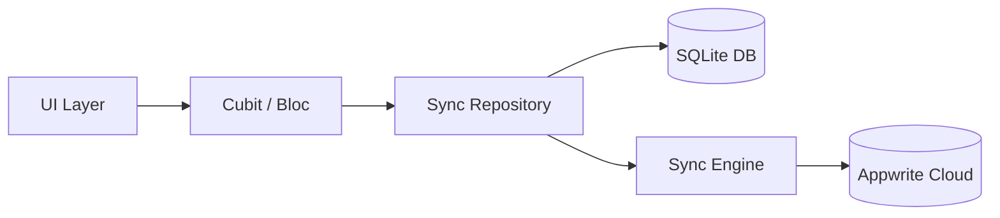

# WhatsUnity

> Community-centric residential management for compounds and buildings—chat, operations, and social tools in one Flutter client backed by Appwrite.

---

## 🚀 Production Status
WhatsUnity is production-ready, featuring a robust **offline-first** architecture and a fully migrated **Appwrite** cloud backend.

- **Backend**: Appwrite (Auth, Databases, Realtime, Functions, Messaging).
- **Storage**: Cloudflare R2 (Static Files) & Gumlet (Voice/Video Streaming).
- **Local Persistence**: SQLite (`sqflite`) for full offline capability.

---

## 🛠 Core Architecture

WhatsUnity utilizes a sophisticated data orchestration layer to ensure responsiveness and reliability.

### Offline-First Logic
The app treats local SQLite as the **source of truth**. All writes are first committed locally and then enqueued for synchronization. Conflict resolution follows a **Last-Write-Wins (LWW)** strategy using system versioning.

### Unidirectional Data Flow

For a detailed breakdown, see [TECHNICAL_ARCHITECTURE.md](docs/TECHNICAL_ARCHITECTURE.md).

---

## ✨ Key Features

### 💬 Real-time Communication
- **Community Chat**: Scoped to the entire compound.
- **Building Chat**: Private threads for residents of the same building.
- **Rich Media**: Voice notes with waveforms, image sharing, and file attachments.
- **Realtime Sync**: Powered by Appwrite Realtime with local cache updates.

### 🛠 Resident Operations
- **Maintenance & Security**: Submit reports with photos/videos. Offline submission with background sync.
- **Gate Passes**: Generate guest access codes for security verification.
- **Compound Social**: Post updates, share media, and participate in community brainstorms (polls).

### 🔔 Smart Notifications
- **Lifecycle Aware**: Suppresses local notifications when the app is foregrounded.
- **Multi-Platform**: Supports Android Local Notifications, iOS APNS, and Web Browser Push.
- **Mention System**: Badge counters for `@everyone`, `@admin`, and personal mentions.

---

## 🌍 Tech Stack

| Layer | Technology |
| :--- | :--- |
| **UI** | Flutter (Material 3), Google Fonts |
| **State** | Bloc / Cubit (`flutter_bloc`) |
| **Database** | Appwrite TablesDB + SQLite (Local) |
| **Auth** | Appwrite Account + Native Google OAuth2 |
| **Media** | Cloudflare R2, Gumlet Video API |
| **Messaging** | Appwrite Messaging (FCM/Web Push) |

---

## 📜 Documentation Index

- **Technical Deep-Dive**: [TECHNICAL_ARCHITECTURE.md](docs/TECHNICAL_ARCHITECTURE.md)
- **Database Schema**: [APPWRITE_SCHEMA.md](APPWRITE_SCHEMA.md)
- **Notification System**: [technical_notification_system.md](docs/technical_notification_system.md)
- **Privacy Policy**: [Privacy_policy.md](assets/Privacy%20and%20policy/Privacy_policy.md)
- **Terms & Conditions**: [Terms_conditions.md](assets/Privacy%20and%20policy/Terms_conditions.md)

---

## 🛡 License
**Copyright © 2026 Nour Adawy. All rights reserved.**
Proprietary and confidential. No part of this software may be used, modified, or distributed without explicit written permission.
