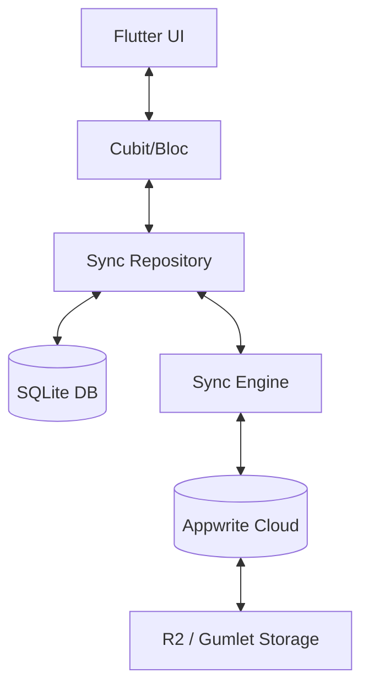

# WhatsUnity Technical Architecture

This document provides a deep dive into the WhatsUnity system architecture, focusing on its offline-first capabilities, data orchestration layers, and Appwrite-centric backend.

## 1. Core Architecture Principles

WhatsUnity is built as an **offline-first** application. This means the local device state is the primary source of truth for the UI, ensuring the app remains functional in zero-connectivity environments.

### 1.1 Layered Data Flow
The application follows a strict unidirectional data flow within each feature module:
1.  **UI (Widgets/Pages)**: Watches Bloc/Cubit states.
2.  **State Management (Bloc/Cubit)**: Coordinates business logic; only interacts with the Repository.
3.  **Repository**: Orchestrates data between the Local Data Source (SQLite) and the Sync Engine/Remote Data Source.
4.  **Local Data Source (sqflite)**: Performs synchronous/asynchronous CRUD on the local SQLite database.
5.  **Sync Engine**: A background worker that monitors "dirty" local records and pushes changes to Appwrite while pulling remote updates.
6.  **Remote Data Source (Appwrite)**: The authoritative cloud backend.

## 2. Offline-First Orchestration

Every entity (Messages, Reports, Profiles) implements a `SyncMetadata` mixin providing tracking fields:
- `sync_state`: `clean`, `dirty`, `pending_delete`, `failed`.
- `version`: An integer incremented on every change for **Last-Write-Wins (LWW)** conflict resolution.
- `local_updated_at` / `remote_updated_at`: Timestamps used to determine sync priority.

### 2.1 Write Path (Optimistic UI)
1. User performs an action (e.g., sends a message).
2. The Repository saves the record to SQLite with `sync_state: dirty`.
3. The UI updates immediately from the local DB.
4. A `sync_job` is enqueued in the local `sync_jobs` table.
5. The Sync Engine attempts to push the change to Appwrite. Upon success, the local record is marked `clean`.

### 2.2 Read Path
1. The Cubit requests data.
2. The Repository returns a Stream or Future of the local SQLite data.
3. Simultaneously, a background pull operation fetches remote changes since the last `remote_updated_at`.
4. Remote changes are merged into SQLite using LWW logic; the local DB triggers a UI refresh via the Stream.

## 3. Data Schema & Persistence

### 3.1 Appwrite Tables (Collections)
We avoid Appwrite's internal relationship attributes to maintain offline simplicity. All foreign keys are flat `String` IDs.
- **Profiles**: User metadata, status, and verification flags.
- **Messages**: Chat content, partitioned by `channel_id`.
- **User Apartments**: Mapping users to specific buildings and compounds.
- **Maintenance Reports**: System-generated codes (`MR-XXXXXX`) managed by Appwrite Functions.

### 3.2 File Storage Strategy
- **Cloudflare R2**: Used for static assets (images, PDFs, documents). Metadata is stored as JSON within the Appwrite document.
- **Gumlet**: Dedicated for time-based media (Voice Notes and Video). The system stores playback URLs and `asset_id`s for HLS streaming.

## 4. Realtime & Notifications

### 4.1 Realtime Synchronization
The app maintains a single `AppwriteRealtime` connection. Subscriptions are scoped to the active user's context (Current Compound and Building).
- **Role Changes**: Monitored via the `user_roles` collection. Changes trigger an immediate state rebuild and local session update.
- **Chat**: Individual channel subscriptions push inserts/updates directly into the local SQLite DB.
- **Apartment Occupancy**: Realtime monitoring of the `user_apartments` collection. As users select a compound, the app tracks registrations to provide instant feedback if an apartment becomes taken during the signup flow.
- **Member Discovery**: Monitors "create" events on `user_apartments` to detect newcomers, fetch their profiles, and update the local member cache without a full reload.

### 4.2 Local Caching & Performance
- **Image Caching**: All remote URLs (avatars/attachments) are handled by `CachedNetworkImage` for local disk persistence.
- **Member Caching (SQLite)**: Compound members are persisted in the `members` table.
    - **Initial Load**: Reads from SQLite for instant UI.
    - **Delta Sync**: Fetches only records updated since `last_sync_timestamp`.
- **Occupancy Cache**: A transient local `Set` synchronized via Realtime to ensure second-by-second accuracy for apartment availability.

### 4.3 Lifecycle-Aware Notifications
Managed by the `MessageNotificationLifecycleService`:
1.  **Foreground**: Notifications are suppressed; UI updates in realtime.
2.  **Background/Inactive**: The service uses `flutter_local_notifications` (Android) or the Browser Notification API (Web) to alert the user.
3.  **Terminated**: Appwrite Messaging handles server-side push fanout via a triggered Appwrite Function (`notify_new_message`).

## 5. Security Model

- **Auth**: Appwrite Account-based session management with native Google OAuth2 bridges for Android and Web.
- **Authorization**: Role-based access control (RBAC) enforced via Appwrite Database permissions and client-side Cubit logic.
- **Data Privacy**: Residents are scoped strictly to their registered compound and building. Personal documents (Proof of Ownership) are stored in restricted buckets accessible only by verified administrators.
