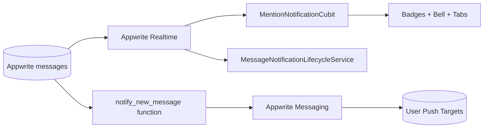

# WhatsUnity Notification System - Technical Documentation

This document describes the complete notification architecture currently implemented in WhatsUnity, including in-app badges, lifecycle-aware local/browser notifications, and server-side push orchestration for terminated-state delivery.

For deployment/operator steps, see `docs/notification_setup_runbook.md`.

## 1) Scope

The notification system has three layers:

- Mention badge counters for chat channels (General + Building).
- Client-side message notifications when app process is alive but not active.
- Server-side push message fanout for terminated app delivery (via Appwrite Messaging).

## 2) Terminology

- `General Chat`: channel type `COMPOUND_GENERAL`
- `Building Chat`: channel type `BUILDING_CHAT`
- `Total Unread Mentions`: `General + Building`
- `Foreground`: app lifecycle `resumed`
- `Background/Inactive`: app process alive but not currently active
- `Terminated`: app process killed/closed

## 3) Architecture Overview



## 4) In-App Mention Notification Layer

### 4.1 Core state

File: `lib/features/chat/presentation/bloc/mention_notification_cubit.dart`

State fields:

- `unreadGeneralMentionCount`
- `unreadBuildingMentionCount`
- `totalUnreadMentionCount`
- `isLoading`

### 4.2 Mention detection

Mentions are counted from channel messages newer than local last-seen markers:

- `@everyone`
- `@admin` (admin role only)
- normalized `@display_name`

Last-seen markers are stored in `SharedPreferences` per:

- user
- compound
- channel scope

### 4.3 UI mapping

- General badge: Social/Chat top tab in `Social.dart`
- Building badge: bottom nav `Chats` icon in `main_screen.dart`
- Home badge (General reminders): bottom nav `Home` icon in `main_screen.dart`
- Bell badge (global): `totalUnreadMentionCount` in `home_page.dart`

## 5) Lifecycle-Aware Client Notification Layer

### 5.1 Service responsibilities

File: `lib/core/services/message_notification_lifecycle_service.dart`

Responsibilities:

- Observe authenticated context (user/compound/building)
- Resolve tracked channel IDs
- Subscribe to realtime inserts per tracked channel
- Suppress notifications when app is foreground (`resumed`)
- Emit notifications when app is background/inactive
- Deduplicate by `(userId, messageId)` persisted in `SharedPreferences`

### 5.2 Platform behavior

- Android/iOS path: `flutter_local_notifications`
- Web path: Browser Notifications API via:
  - `browser_notification_bridge.dart`
  - `browser_notification_bridge_web.dart`
  - `browser_notification_bridge_stub.dart`

### 5.3 Lifecycle wiring

File: `lib/features/home/presentation/pages/main_screen.dart`

- `WidgetsBindingObserver` forwards app lifecycle changes to service.
- Service starts/stops with auth state transitions.

## 6) Server Push Layer (Terminated Delivery)

### 6.1 Function

Path: `functions/notify-new-message/src/main.js`

Purpose:

- Trigger on message create events.
- Fetch message + channel context.
- Resolve target users by channel scope:
  - `COMPOUND_GENERAL`: all `user_apartments` in same `compound_id`
  - `BUILDING_CHAT`: users in same `compound_id` + `building_num`
- Exclude author.
- Send one Appwrite push message via `Messaging.createPush(...)` targeting users.

### 6.2 Event sources

Configured for Appwrite events on messages creation using TablesDB path (`databases.*.tables.messages.rows.*.create`).

### 6.3 Delivery preconditions

Server push requires:

- Appwrite Messaging provider configured (FCM/Web Push/APNS as needed).
- User push targets registered in Appwrite Messaging.

Without targets/provider, the function executes but no device receives push.

## 6.4 Client push-target registration

Files:

- `lib/core/services/push_target_registration_service.dart`
- `lib/core/di/app_services.dart`
- `lib/features/home/presentation/pages/main_screen.dart`

Flow:

1. User authenticates.
2. `MainScreen` starts `PushTargetRegistrationService` for active auth user.
3. Service initializes Firebase Messaging.
4. Service requests notification permission and fetches device token.
5. Service calls Appwrite Account push-target API:
   - `createPushTarget(...)` on first registration
   - `updatePushTarget(...)` on token refresh
6. Service stores `targetId` and last token in `SharedPreferences`.

Token refresh:

- Listens to `FirebaseMessaging.onTokenRefresh`.
- Updates existing Appwrite target identifier for same user.

Persistence keys:

- `push_target_id_v1_<userId>`
- `push_token_v1_<userId>`

## 6.5 Runtime configuration

Required Appwrite function vars for `notify_new_message`:

- `APPWRITE_ENDPOINT`
- `APPWRITE_PROJECT_ID`
- `APPWRITE_API_KEY`
- `APPWRITE_DATABASE_ID`

Optional app vars:

- `APPWRITE_PUSH_PROVIDER_ID` (forces provider route in `createPushTarget`)

Web Firebase vars (used by registration service):

- `FIREBASE_WEB_API_KEY`
- `FIREBASE_WEB_APP_ID`
- `FIREBASE_WEB_PROJECT_ID`
- `FIREBASE_WEB_MESSAGING_SENDER_ID`
- `FIREBASE_WEB_AUTH_DOMAIN` (optional but recommended)
- `FIREBASE_WEB_STORAGE_BUCKET` (optional)
- `FIREBASE_WEB_MEASUREMENT_ID` (optional)
- `FIREBASE_WEB_VAPID_KEY` (recommended for stable web token issuance)

## 6.6 Platform setup

### Android

- `android/settings.gradle.kts` includes:
  - `com.google.gms.google-services` plugin declaration.
- `android/app/build.gradle.kts` applies:
  - `com.google.gms.google-services`.
- `android/app/src/main/AndroidManifest.xml` includes:
  - `android.permission.POST_NOTIFICATIONS`.
- Ensure valid `google-services.json` is present for target app ID.

### Web

- Service worker file:
  - `web/firebase-messaging-sw.js`
- Must contain real Firebase web config (placeholders replaced).
- App host must serve the service worker file from web root.

## 6.7 Security model

- `notify_new_message` function:
  - Executes by Appwrite events (no direct public execution in config).
  - Validates trusted event context before push dispatch.
  - Excludes sender from recipient list.
- API key scope for function kept minimal:
  - `databases.read`
  - `messaging.write`

## 7) Data Contracts

### 7.1 Message push payload (`data`)

```json
{
  "type": "chat_message",
  "messageId": "<message_id>",
  "channelId": "<channel_id>",
  "channelType": "COMPOUND_GENERAL|BUILDING_CHAT"
}
```

### 7.2 Titles

- `General chat`
- `Building chat`

## 8) Security and Privacy

- Sender user is excluded from recipient list.
- Recipient resolution is channel-scoped.
- No sensitive raw metadata is sent in push body; text is truncated.
- Function uses server API key with least required scopes.

## 9) Failure Modes and Mitigations

- Missing provider/targets -> no device delivery (function logs warning path).
- Duplicate events -> dedupe can be added by idempotency key (message ID).
- Large compounds -> recipients list pagination should be extended if needed.
- Malformed payloads -> function validates required fields and exits safely.

## 10) Observability

Recommended checks:

- Function execution status in Appwrite Console.
- Messaging logs for push creation and target processing.
- Client-side logs for lifecycle transitions and local-notification fallback.
- Appwrite Account target list for logged-in users (target creation/update).

## 10.1 Verification matrix (release gate)

1. Login from Android device -> verify target created for account.
2. Refresh token scenario (reinstall or FCM refresh) -> verify target updated.
3. Send message while receiver app is:
   - foreground -> no local popup, realtime UI update only.
   - background -> local/browser notification shown.
   - terminated -> Appwrite push delivered.
4. Receiver equals author -> no push delivered.
5. General channel message -> users in same compound only.
6. Building channel message -> users in same compound + building only.

## 11) Operational Checklist

1. Deploy function `notify_new_message`.
2. Set function environment:
   - `APPWRITE_ENDPOINT`
   - `APPWRITE_PROJECT_ID`
   - `APPWRITE_API_KEY`
   - `APPWRITE_DATABASE_ID`
3. Ensure Messaging provider is enabled.
4. Ensure users have push targets (registration service running and tokens present).
5. Verify:
   - Foreground: no local popup, chat updates realtime.
   - Background: local/browser popup.
   - Terminated: server push received.
6. For web, verify `firebase-messaging-sw.js` is served and active.

## 12) Key Files Index

- `lib/features/chat/presentation/bloc/mention_notification_cubit.dart`
- `lib/features/home/presentation/pages/main_screen.dart`
- `lib/features/home/presentation/pages/home_page.dart`
- `lib/features/social/presentation/pages/Social.dart`
- `lib/core/services/message_notification_lifecycle_service.dart`
- `lib/core/services/browser_notification_bridge.dart`
- `functions/notify-new-message/src/main.js`
- `README.md`
